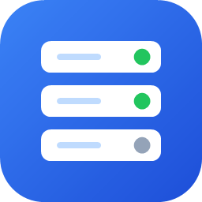

# LocalRack



LocalRack is a lightweight Windows app for running your local development services — frontends, APIs, workers — from one window. Define each service once, then start, stop, and watch its logs with a click instead of juggling terminal tabs.

## Features

- **Projects and services** — group related services (for example a frontend, a backend, and a worker) under one project.
- **One-click start and stop** — stopping a service shuts down its entire process tree, so no stray `node` or `python` process is left holding a port.
- **Live, colored logs** — real-time output with full terminal colors, errors highlighted, and text you can select and copy like in a terminal.
- **PowerShell or Command Prompt** — pick the shell per service, so commands work exactly as you would type them.
- **Tabs** — open several projects side by side; your open tabs come back the next time you launch.
- **System tray and start with Windows** — optionally keep services running in the background with LocalRack tucked away in the tray.

## Requirements

- Windows 10 or 11 (64-bit)
- Whatever your services need (Node.js, Python, .NET, and so on), installed as you would for running them in a terminal

The release download is self-contained: you do not need to install .NET to run it.

## Install

1. Open the repository's **Releases** page and download `LocalRack-vX.Y.Z-win-x64.exe` from the latest release.
2. Move it somewhere permanent, for example `C:\Tools\LocalRack\LocalRack.exe`.
3. Run it.

The executable is not code-signed yet, so Windows SmartScreen may show **Windows protected your PC** the first time. Choose **More info**, then **Run anyway**.

To verify a download, compare its hash with `SHA256SUMS.txt` from the same release:

```powershell
Get-FileHash .\LocalRack-v1.0.0-win-x64.exe -Algorithm SHA256
```

## Getting started

1. **Add a project.** On the Home page, select **Add Project** and give it a name, such as `My SaaS App`.
2. **Open it.** Click the project card. It opens in its own tab.
3. **Add a service.** Select **Add Service** and fill in:
   - **Name** — for example `Backend API`.
   - **Working directory** — the folder the command runs in. Use **Browse…** to pick it.
   - **Command** — exactly what you would type in a terminal in that folder.
   - **Run with** — PowerShell or Command Prompt. The command syntax must match the shell you pick.
4. **Start it.** Select **Start** next to the service. The dot turns green and logs stream on the right.
5. **Stop it.** Select **Stop**. The service and every process it started are shut down.

### Example commands

| Stack | Run with | Command |
| --- | --- | --- |
| Node / Vite | PowerShell or Command Prompt | `npm run dev` |
| Python venv + uvicorn | PowerShell | `.\venv\Scripts\Activate; uvicorn main:app --reload --port 8001` |
| Python venv + uvicorn | Command Prompt | `venv\Scripts\activate && uvicorn main:app --reload --port 8001` |
| .NET | PowerShell or Command Prompt | `dotnet watch run` |
| Rust | PowerShell or Command Prompt | `cargo run` |

In PowerShell, chain commands with `;`. In Command Prompt, use `&&`.

### Everyday use

- **Edit or delete a service** — double-click it, right-click it, or use the **Edit** and **Delete** buttons above its logs.
- **Rename or delete a project** — use the buttons on its card on the Home page.
- **Copy from the logs** — drag to select, double-click a word, press Ctrl+A to select everything, then Ctrl+C or right-click **Copy**.
- **Clear logs** — select **Clear Logs**. Each service keeps its most recent 2,000 lines.
- **Closing a tab** only hides the project; its services keep running.

## Settings

Open **Settings** from the Home page.

- **Start LocalRack with Windows** — launches LocalRack when you sign in. It does not start any services by itself.
- **Keep running in the system tray** — minimizing or closing the window hides LocalRack to the tray and your services keep running. Click the tray icon to reopen it; right-click it and choose **Exit LocalRack** to quit and stop all services. With both settings on, LocalRack starts quietly in the tray.

When tray mode is off, closing the window stops all running services and exits.

## Where your data lives

Everything is stored per user in `%APPDATA%\LocalRack`:

| File | Contents |
| --- | --- |
| `projects.json` | Your projects and services. Safe to back up or edit by hand while LocalRack is closed. |
| `ui-state.json` | Which project tabs were open. |
| `settings.json` | App preferences. |
| `error.log` | Details of any unexpected error, if one occurs. |

## Build from source

You need the [.NET 8 SDK](https://dotnet.microsoft.com/download/dotnet/8.0) on Windows.

```powershell
git clone <repository-url>
cd <repository-folder>

# Build and run
dotnet run --project LocalRack.csproj

# Create the self-contained single-file exe in .\publish
dotnet publish LocalRack.csproj -c Release -r win-x64 -o .\publish
```

### Project layout

| Folder | Contents |
| --- | --- |
| `Models/` | Projects, services, log lines, and settings |
| `Services/` | Process management, log color parsing, persistence, tray icon, startup registration |
| `Views/` | Home page, project tabs, and Settings |
| `Dialogs/` | Add and edit dialogs for projects and services |
| `Themes/` | Colors, control styles, and the vector logo |

## Releasing

The CI workflow (`.github/workflows/ci.yml`) builds every push and pull request to `main`. Pushing a version tag also publishes a GitHub release:

1. Add release notes at `docs/releases/vX.Y.Z.md`.
2. Commit, then tag and push:

   ```powershell
   git tag -a vX.Y.Z -m "LocalRack vX.Y.Z"
   git push origin main vX.Y.Z
   ```

The workflow builds the exe with the version from the tag and attaches it, together with `SHA256SUMS.txt` and your release notes, to a new release. It fails early if the tag is not in `vX.Y.Z` form or the notes file is missing.

## License

[MIT](LICENSE)
